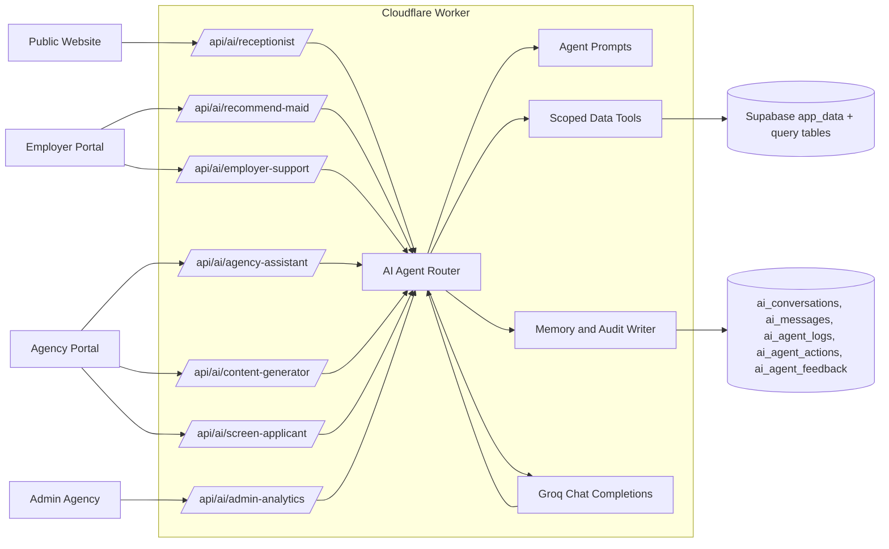

# Helped AI Agent Architecture

## 1. Architecture Diagram



## 2. Database Changes

Added production tables in `supabase/helped_full_production_schema.sql`:

- `ai_conversations`: durable conversation/session memory by agent and actor.
- `ai_messages`: user/assistant/tool history for context replay.
- `ai_agent_logs`: audit trail with input, output, status, latency, actor, agency.
- `ai_agent_actions`: proposed or approved operational actions before execution.
- `ai_agent_feedback`: ratings and comments for quality improvement.

All AI tables use RLS and service-role-only access, matching the existing `app_data` security posture.

## 3. API Design

Implemented Worker endpoints:

- `POST /api/ai/receptionist`: public website assistant and lead collection.
- `POST /api/ai/recommend-maid`: employer-authenticated maid ranking.
- `POST /api/ai/employer-support`: employer-authenticated support.
- `POST /api/ai/agency-assistant`: agency-authenticated operations assistant.
- `POST /api/ai/screen-applicant`: agency-authenticated applicant screening.
- `POST /api/ai/screen-applicant-public`: applicant-token-scoped readiness check from status links.
- `POST /api/ai/admin-analytics`: agency admin analytics.
- `POST /api/ai/content-generator`: agency-authenticated content drafts.

Common request fields:

```json
{
  "message": "What should I do next?",
  "conversationId": "optional-uuid",
  "stream": false,
  "structured": false
}
```

Agent-specific fields are accepted as JSON, such as `budget`, `nationalityPreference`, `childcareExperience`, `applicationId`, or `contentType`.

## 4. Worker Integration Plan

Implemented modular files:

- `functions/api/services/ai/groq.ts`: Groq calls, streaming, retries, rate limiting, JSON parsing.
- `functions/api/services/ai/prompts.ts`: seven specialized agent definitions.
- `functions/api/services/ai/tools.ts`: scoped deterministic tools and data snapshots.
- `functions/api/services/ai/agents.ts`: orchestration, memory reads/writes, audit logs.

The Worker keeps `GROQ_API_KEY` server-side. No browser code receives the key.

## 5. Supabase Integration Plan

The first production version reads existing Worker `app_data`, which already supports Supabase storage and normalized query tables. AI memory writes directly to Supabase REST with the service role key.

Next-stage scaling:

- Add RPC functions for agent-specific data windows.
- Move heavy recommendations to query tables or vector indexes.
- Store embeddings for maid profiles, FAQs, enquiry summaries, and biodata.
- Partition `ai_messages` and `ai_agent_logs` by month at high volume.

## 6. Folder Structure

```text
functions/api/services/ai/
  agents.ts
  groq.ts
  prompts.ts
  tools.ts

supabase/
  helped_full_production_schema.sql

frontend/src/
  components/ai/
  pages/
  ClientPage/
```

## 7. Agent Prompts

Prompts are centralized in `prompts.ts`. Every agent inherits shared guardrails:

- Use only provided context/tool results.
- Do not invent policy, status, legal, salary, contract, or verification facts.
- Respect actor and agency permissions.
- Keep answers operational and concise.

Each agent then has a role-specific prompt for receptionist, recommendation, employer support, agency operations, screening, analytics, and content generation.

## 8. Memory Strategy

Memory tiers:

- Short-term: last 12 `ai_messages` in the current conversation.
- User context: actor role, client ID, agency ID, agency name.
- Agency context: scoped requests, maids, messages, contracts, enquiries, ATS applications.
- Audit memory: immutable `ai_agent_logs` for every success/error.
- Action memory: `ai_agent_actions` stores proposed actions before humans approve execution.

This is safe for thousands of users because retrieval is conversation-scoped and agency-filtered.

## 9. Security Model

- Public: only `/api/ai/receptionist`, public agency data, public maids, and voluntary lead details.
- Employer: `/recommend-maid` and `/employer-support` require `requireClientAuth`.
- Agency/admin: agency assistant, content, screening, and analytics require `requireAgencyAdminAuth`.
- Data minimization: tool snapshots strip large media blobs and include compact records.
- Auditability: every agent run logs actor, agency, input, output/error, and latency.
- Secret handling: `GROQ_API_KEY` stays in Cloudflare Worker environment variables.

## 10. Implementation Roadmap

1. Foundation: Groq service, prompts, tools, endpoints, memory tables.
2. UI: receptionist widget, employer recommendation/support panel, agency AI workspace.
3. Data quality: add FAQ table, content templates, applicant requirement matrix.
4. Retrieval: add embeddings for maid biodata, FAQs, messages, and documents.
5. Human-in-the-loop actions: approve/send generated replies, schedule follow-ups, create notifications.
6. Observability: dashboards for token use, latency, error rates, feedback, and conversion.
7. Scale: Supabase RPCs, indexes, table partitioning, and per-role quotas.
